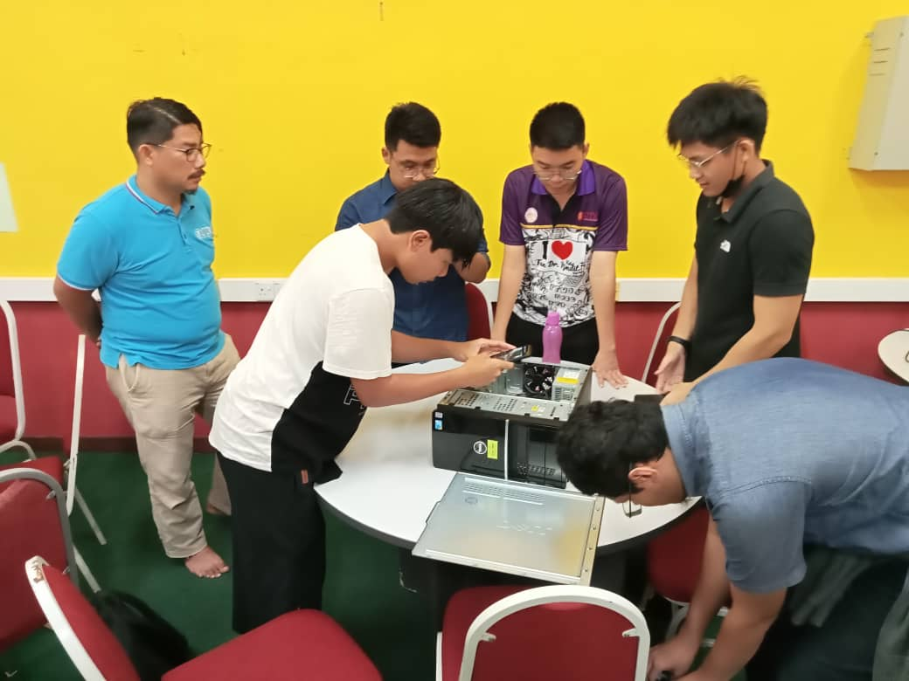

Hi My name is Chong Zu Wei
====================================================================================================================================

I'm a student who studies software engineering at UTM.
------------------------------------------------------

* 🌍  I'm based in Sitiawan , Perak, Malaysia.
* ✉️  You can contact me at [chongzuwei@graduate.utm.my](mailto:chongzuwei@graduate.utm.my)
* 🧠  I'm learning on software engineering at UTM
* 🤝  I'm open to collaborating on project assignment
* ⚡  I'm a motivated self learner.

### Skills

### Socials

 <a href="https://www.github.com/chongzuwei" target="_blank" rel="noreferrer"> <picture> <source media="(prefers-color-scheme: dark)" srcset="https://raw.githubusercontent.com/danielcranney/readme-generator/main/public/icons/socials/github-dark.svg" /> <source media="(prefers-color-scheme: light)" srcset="https://raw.githubusercontent.com/danielcranney/readme-generator/main/public/icons/socials/github.svg" />  </picture> </a> <a href="http://www.instagram.com/chong.zuwei?igshid=OGQ5ZDc2ODk2ZA==" target="_blank" rel="noreferrer"> <picture> <source media="(prefers-color-scheme: dark)" srcset="undefined" /> <source media="(prefers-color-scheme: light)" srcset="https://raw.githubusercontent.com/danielcranney/readme-generator/main/public/icons/socials/instagram.svg" />  </picture> </a>

### Badges

<b>Top Repositories</b>

       

### Courses and Certificate

  
  

  
  

The photoes above is my result.

### Assignments
<article>
									<header>
										<h2><a href="#">Assignment 1:  
										Report on Visit to NALI 2023</a></h2>
									</header>
									
									
Reflection:During the visit, I visited many booths and concluded that technology is essential to us for improving the quality of life. Most of the applications and products that were invented are very useful and help us facilitate our working process. Beside that,I also gained more experience and ideas from the interviewee after interview session. However, the sound of NALI’s briefing is too loud, which causes the sounds of the interviewer and interviewee to not be clear during the interview session. I have a whale of time at there!!!!

									<ul class="actions special">
										<li><a href="https://github.com/chongzuwei/assignment/blob/93cde31228b77015e3f4ead689f92c6b9353de4d/tis(2)%20(1).pdf" class="button">Go to assignment 1</a></li>
									</ul>
								</article>
								<article>
									<header>
										<h2><a href="#">Assignment 2:  
										Poster on Industrial Talk 1</a></h2>
									</header>
									
									
Reflection:From the talk, I realized that continuous learning is very important in our career path. This can improve your competence and ensure you remain relevant to your industry by keeping up to date with trends. For example, a highly motivated self-learner can gain more experience from the projects. Beside that,I also know what their daily routine is and what challenges their team meets, so I can avoid the challenges that they meet and know how to solve them in the future.

									<ul class="actions special">
										<li><a href="https://github.com/chongzuwei/assignment/blob/93cde31228b77015e3f4ead689f92c6b9353de4d/Modern%20Stationary%20Paper%20Border%20(1)%20(1)%20(1).pdf" class="button">Go to assignment 2</a></li>
									</ul>
								</article>
								<article>
									<header>
										<h2><a href="#">Assignment 3:  
										Video on Visit to UTMDigital and the Attended Virtual Talk</a></h2>
									</header>
									
									
Reflection:From the virtual talk,I know what kind of services are provided by UTM Digital, such as UTM WiFi,UTM Smart, and the MyUTM portal. They actually help many students tackle their problems in their daily routine. From the visit of UTM Digital,I understand how UTM Digital works and the UTM Digital staff's daily routine. Lastly, I really appreciate the UTM Digital staff effort and thank them for their hard work to let the students have a better experience with their service.

									<ul class="actions special">
										<li><a href="https://github.com/chongzuwei/assignment/blob/3293c17927cce7300ccb9372c9568ea64091dafe/Assignment%203%20TIS%20(2).pdf" class="button">Go to assignment 3</a></li>
									</ul>
								</article>
								<article>
									<header>
										<h2><a href="#">Assignment 4: 
										 Report on Industrial Talks 2a or 2b</a></h2>
									</header>
									
									
Reflection:From the talk, I know the importance of data analytics, which helps companies make decisions and create a more effective long-term marketing strategy that can improve customer satisfaction. Furthermore,I also realized that industrial training is important for our future. This is because it provides many opportunities that can help us enhance our technical skills and problem-solving skills.

									<ul class="actions special">
										<li><a href="https://github.com/chongzuwei/assignment/blob/93cde31228b77015e3f4ead689f92c6b9353de4d/Minimalist%20Simple%20Annual%20Report%20Cover%20(1)%20(1).pdf" class="button">Go to assignment 4</a></li>
									</ul>
								</article>
								<article>
									<header>
										<h2><a href="#">Project: 
										PC Assemble</a></h2>
									</header>
									
									
From PC Assemble,I understand the importance of each component on the desktop  such as motherboard, CPU, RAM, GPU, storage, and power supply. Moreover,this also helps me know that PC assembly requires a delicate touch. Connecting components with care is essential to avoid damage. It's an empowering experience that can help us to know more about the PC.

									<ul class="actions special">
									</ul>
								</article>
								<article>
									<header>
										<h2><a href="#">Project: 
										Design Thinking</a></h2>
									</header>
									
									
Reflection:

									<ul class="actions special">
										<li><a href="#" class="button">Full Story</a></li>
									</ul>
								</article>

