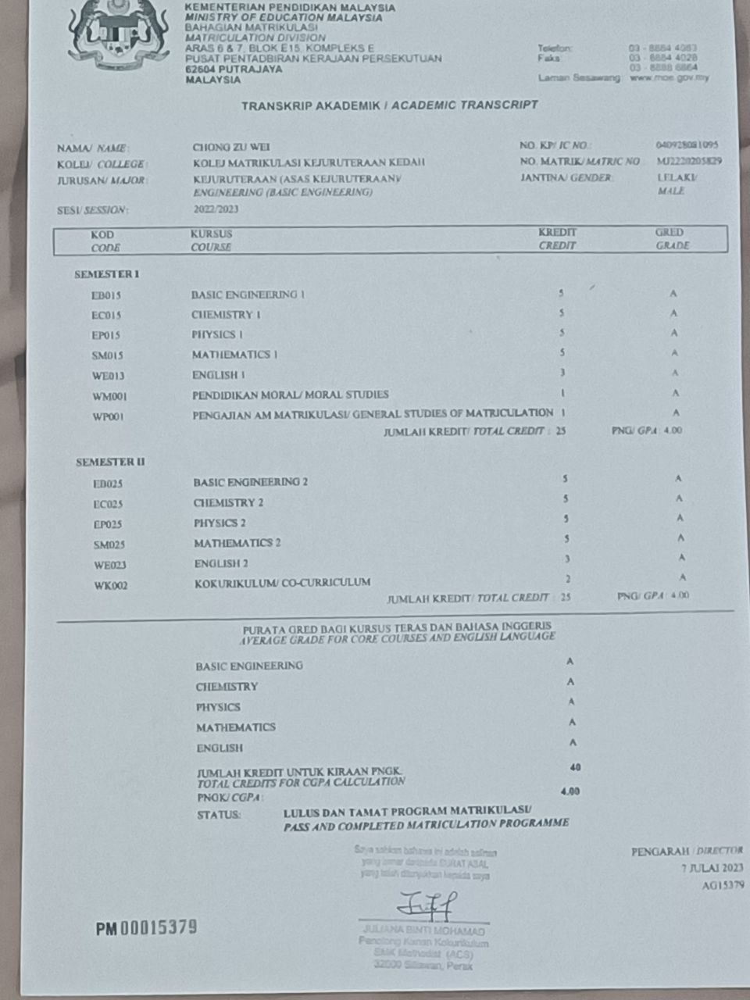

Hi My name is Chong Zu Wei
====================================================================================================================================

I'm a student who studies software engineering at UTM.
------------------------------------------------------

* 🌍  I'm based in Sitiawan , Perak, Malaysia.
* ✉️  You can contact me at [chongzuwei@graduate.utm.my](mailto:chongzuwei@graduate.utm.my)
* 🧠  I'm learning on software engineering at UTM
* 🤝  I'm open to collaborating on project assignment
* ⚡  I'm a motivated self learner.

### Skills

### Socials

 <a href="https://www.github.com/chongzuwei" target="_blank" rel="noreferrer"> <picture> <source media="(prefers-color-scheme: dark)" srcset="https://raw.githubusercontent.com/danielcranney/readme-generator/main/public/icons/socials/github-dark.svg" /> <source media="(prefers-color-scheme: light)" srcset="https://raw.githubusercontent.com/danielcranney/readme-generator/main/public/icons/socials/github.svg" />  </picture> </a> <a href="http://www.instagram.com/chong.zuwei?igshid=OGQ5ZDc2ODk2ZA==" target="_blank" rel="noreferrer"> <picture> <source media="(prefers-color-scheme: dark)" srcset="undefined" /> <source media="(prefers-color-scheme: light)" srcset="https://raw.githubusercontent.com/danielcranney/readme-generator/main/public/icons/socials/instagram.svg" />  </picture> </a>

### Badges

<b>Top Repositories</b>

       

### Courses and Certificate

  
  

  
  

The photoes above are my result and offer.

### Assignments
Here are my assignment and project:
- [ASSIGNMENT 1 : REPORT ON VISIT TO NALI 2023](https://github.com/chongzuwei/eportfolio/blob/b23b047b94dfbe19e75eba0adee578acf391ffde/ASSIGNMENT%201%20%20REPORT%20ON%20VISIT%20TO%20NALI%202023.pdf)

### Reflection:
During my visit, I explored many booths and gained insights into the significance of technology in improving our quality of life. Engaging with different applications and products provided me with a broader perspective on how technology can enhance efficiency and contribute to overall well-being. However, it's unfortunate that the sound quality during NALI's briefing was too loud, affecting the clarity of the interview session.  Overall,I think this activity is important for students to open their minds, and I had a whale of time at there!!!!

- [ASSIGNMENT 2 : POSTER ON INDUSTRIAL TALK 1](https://github.com/chongzuwei/eportfolio/blob/cd4af59cf0044cca260bcd83187efe7030e52cdc/ASSIGNMENT%202%20POSTER%20ON%20INDUSTRIAL%20TALK%201.pdf)

  

Reflection:

